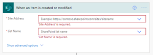

# Message Center in Teams


## Solution is out of order since Jan 3rd, the MC API changed we are working on updating the code :)

## Description

Message Center in Teams is a simple PowerAutomate Solution to gather Message Center Announcement and post them in a Teams Channel.
Its goal is to leverage Teams and SharePoint list to ease the access and simplify sharing of message center announcement.


## Deployment steps

  - [PreReqs](#prereqs)
  - Azure AD
    - [Create the Azure AD App Id](#create-the-azure-ad-app-id)
  - Microsoft Teams
    - [Create the Microsoft List in the team of your choosing](#create-the-microsoft-list-in-the-team-of-your-choosing)
  - PowerAutomate
    - [Import the 3 flows in PowerAutomate](#import-the-3-flows-in-powerautomate)
    - [Configure the **Initiate MC** flow](#configure-the-initiate-mc-flow)
    - [Configure the **Get New MC** flow](#configure-the-get-new-mc-flow)
    - [Configure the **Post in Teams - Teams MC** flow](#configure-the-post-in-teams---teams-mc-flow)

### PreReqs

- This solution require at least 1 PowerAutomate user license for the person that will import the flows, they use Premium Connector to query the management API.

- You will need Azure AD administrator priviledge to [register your app](https://docs.microsoft.com/en-us/azure/active-directory/develop/howto-create-service-principal-portal#permissions-required-for-registering-an-app) and [consent permission for your app](https://docs.microsoft.com/en-us/azure/active-directory/manage-apps/grant-admin-consent#grant-admin-consent-in-app-registrations).

### Create the Azure AD App Id

Create an Azure AD app to Query the Message Center API.

- Go in App Registrations view in [Azure AD admin portal](https://aad.portal.azure.com/#blade/Microsoft_AAD_IAM/ActiveDirectoryMenuBlade/RegisteredApps)

    

    Click register a New apps in your tenant.
- Name it accordingly and keep the default configuration

    

- Please keep the application ID and Tenant ID that will be needed for later use

    

- Open the API Permissions view and Click “+ Add a permission”

    

- Choose Office 365 Management API

    

- Choose Application permissions for later use in the Power Automate

     

- Select ServiceHealth.Read

    

- Remove the Default Microsoft Graph Permission (User.Read)
    

- Grant Admin Consent for your tenant (Extra permission Required see PreReqs)

    
    

- Go in Certificates & Secrets section to generate a new Client secrets

    

- Name it and choose an expiry date according to your security practice

    

- Save the Generated Secret for later use, it cannot be displayed again

    

### Create the Microsoft List in the team of your choosing

- Open in Teams the team (you are an owner of) you want the solution to be available in

    

- Click the + sign and add Lists as a tab in the general channel

    
    

- In the Lists Tab click Create a list

    

- Click the From Excel button and upload the list template you can find in the Lists Export folder

    
    

- Make sure you configure the right column types for each one

    

    | **Column Title** | **Type**  |
    |---------|---------|
    |Title     | Title      |
    |Product     | Single line of text        |
    |PublishedTime     | Date and time      |
    |RowLastUpdate Message     | Multiple lines of text        |
    |LastUpdate Time      | Date and time        |
    |MessageID     | Single line of text        |
    |MessageText     | Multiple lines of text         |

- Finish the list creation by giving it a name, description, an icon and a color

    

- Edit List fields to support rich text, right click on MessageText, Column settings & Edit

    

- Click on **More options** and make sure that the **Use enhanced rich text** check box is on and click Save

    

- Do the same for the column **LastUpdate Message**
- Open the list in SharePoint Online

    

- Modify the current View to improve the presentation of MC

    

- Change the Column displayed : Title (linked to item), Product and PublishedTime in that order

    

- Change host sort the items : sort by PublishedTime in ascending order

    

### Import the 3 flows in PowerAutomate

- Download the flows that are [available here](https://github.com/ericsche/MCinTeams/tree/main/PowerAutomate%20Exports)

- Connect to [PowerAutomate](https://flow.microsoft.com/) with a user that has a **PowerAutomate user plan** license
  
- Navigate to the **My flows** page and click the Import button

    

- Look for the flows and upload the first one

    

- You will be asked to updates some for the flow informations before you can more forward. Feel free to update the name of the flow and marke sure you import connections so PowerAutomate can connect to the List and Teams. The account you should should be at least a member of the team you should to host the List and the channel where the message will be posted.

    

    

    > **Note:** For the Microsoft Teams connection you can either use your account or a resource account that will avoid you all the notifications from likes & comments if needed.

- Repeat the same steps for all flows

### Configure the **Initiate MC** flow

- Click the **Edit** button for the Initiate MC flow

    

- Now update every variables at the beginning of your flow : **TenantID, ClientID, AppSecret, SharepointSiteURL, ListName**

    

    > **Note:** **TenantID, ClientID & AppSecrets** are values you saved from the [Create the Azure AD App Id](#create-the-azure-ad-app-id) section.
    > **SharepointSiteURL** should be the base URL of the SharePoint Site backing up the team you hosted the solution in. It should look like ```https://TENANT NAME.sharepoint.com/teams/TEAM NAME/``` or ```https://TENANT NAME.sharepoint.com/sites/TEAM NAME/```.
    > **ListName should** be the full name of the list you created in the [Create the Microsoft List in the team of your choosing](#create-the-microsoft-list-in-the-team-of-your-choosing) section.

### Configure the **Get New MC** flow

- Click the **Edit** button for the Get New MC flow
- Now update every variables at the beginning of your flow : **TenantID, ClientID, AppSecret, SharepointSiteURL, ListName**

### Configure the **Post in Teams - Teams MC** flow

- Click the **Edit** button for the Get New MC flow
- Edit the flow trigger : **When an Item is created or modified** make sure you select the Sharepoint site hosting the solution and the List storing the messages.
  
    

- Now update the following variables at the beginning of your flow with the relevant info: **TenantID, ClientID, AppSecret, SharepointSiteURL, ListName**

- You'll also notice a variable named **ProductName** this one control which Product Messages you want to post into Teams. You can use the following table as a reference. You can clone this flow to post the messages you want either in the same channel or to a channel dedicated per Product.

    |**Product Name**  |
    |---------|
    |Dynamics 365   |
    |Dynamics 365 Apps    |
    |Dynamics 365 Business Central    |
    |Exchange Online   |
    |Exchange Online Protection     |
    |Finance and Operations Apps    |
    |Identity Service     |
    |Microsoft 365 Apps     |
    |Microsoft 365 Defender     |
    |Microsoft 365 suite     |
    |Microsoft Bookings     |
    |Microsoft Defender ATP     |
    |Microsoft Forms     |
    |Microsoft Intune     |
    |Microsoft Power Automate     |
    |Microsoft Power Automate in Microsoft 365     |
    |Microsoft Stream     |
    |Microsoft Teams     |
    |Mobile Device Management for Office 365     |
    |Office Client Applications     |
    |Office for the web     |
    |OneDrive for Business     |
    |Planner     |
    |Power Apps     |
    |Power Apps in Microsoft 365     |
    |SharePoint Online     |
    |SharePoint Syntex     |
    |Skype for Business     |
    |Yammer Enterprise     |

>**Note:** List is an export of the product available in June 2021, this will surely evolve, feel free to update it :). For more info related to the datasource please visit the [Office 365 Management API Page](https://docs.microsoft.com/en-us/office/office-365-management-api/).

## Contributing

This project welcomes contributions and suggestions.  Most contributions require you to agree to a
Contributor License Agreement (CLA) declaring that you have the right to, and actually do, grant us
the rights to use your contribution. For details, visit https://cla.opensource.microsoft.com.

When you submit a pull request, a CLA bot will automatically determine whether you need to provide
a CLA and decorate the PR appropriately (e.g., status check, comment). Simply follow the instructions
provided by the bot. You will only need to do this once across all repos using our CLA.

This project has adopted the [Microsoft Open Source Code of Conduct](https://opensource.microsoft.com/codeofconduct/).
For more information see the [Code of Conduct FAQ](https://opensource.microsoft.com/codeofconduct/faq/) or
contact [opencode@microsoft.com](mailto:opencode@microsoft.com) with any additional questions or comments.
