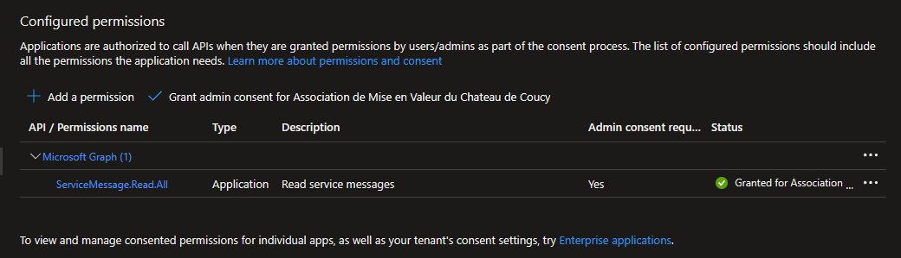
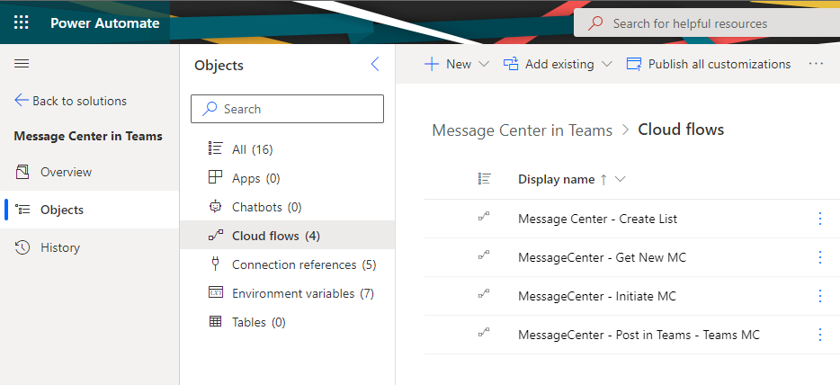
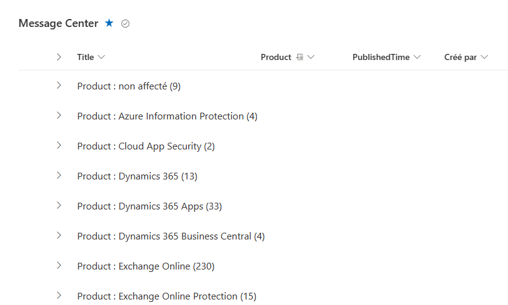

# Message Center in Teams

## Description

Message Center in Teams is a simple PowerAutomate Solution to gather Message Center Announcement and post them in a Teams Channel.
Its goal is to leverage Teams and SharePoint list to ease the access and simplify sharing of message center announcement.

## Deployment steps

- [Message Center in Teams](#message-center-in-teams)
  - [Description](#description)
  - [Deployment steps](#deployment-steps)
    - [PreReqs](#prereqs)
    - [Create the Azure AD App Id](#create-the-azure-ad-app-id)
    - [Import the MC in Teams Solution in Power Automate](#import-the-mc-in-teams-solution-in-power-automate)
    - [Configure the Solution](#configure-the-solution)
    - [Initialize the Solution](#initialize-the-solution)
  - [Contributing](#contributing)

### PreReqs

- This solution require at least 1 PowerAutomate user license for the person that will import the flows, they use Premium Connector to query the management API.

- You will need Azure AD administrator priviledge to [register your app](https://docs.microsoft.com/en-us/azure/active-directory/develop/howto-create-service-principal-portal#permissions-required-for-registering-an-app) and [consent permission for your app](https://docs.microsoft.com/en-us/azure/active-directory/manage-apps/grant-admin-consent#grant-admin-consent-in-app-registrations).

### Create the Azure AD App Id

Create an Azure AD app to Query the Message Center API.

- Go in App Registrations view in [Azure AD admin portal](https://aad.portal.azure.com/#blade/Microsoft_AAD_IAM/ActiveDirectoryMenuBlade/RegisteredApps)

    

    Click register a New apps in your tenant.
- Name it accordingly and keep the default configuration

    

- Please keep the application ID and Tenant ID that will be needed for later use

    

- Open the API Permissions view and Click “+ Add a permission”

    

- Choose **Microsoft Graph**

    

- Choose **Application permissions** for later use in the Power Automate

     

- Select **ServiceMessage.Read.All**. You can use the search function to navigate the list.

    

- Remove the Default Microsoft Graph Permission (User.Read)
    

- Grant **Admin Consent** for your tenant (Extra permission Required see PreReqs)

    

- Go in Certificates & Secrets section to generate a new Client secrets

    

- Name it and choose an expiry date according to your security practice

    

- Save the Generated Secret for later use, it cannot be displayed again

    

### Import the MC in Teams Solution in Power Automate

Message Center in teams v2 now leverage a Power Automate unamanged solution to improve the installation flow. [For more details on Power Automate solutions click here.](https://docs.microsoft.com/en-us/power-automate/overview-solution-flows)

- Download the Power Automate Solution that is [available here](https://github.com/ericsche/MCinTeams/blob/main/MCinTeams_1_0_0_6.zip)

- Connect to [PowerAutomate](https://flow.microsoft.com/) with a user that has a **PowerAutomate user plan** license
  
- Navigate to the **Solutions** page and click the **Import solution** button
  
  

- Select the MCinTeams_1_0_0_6.zip and click **Next**.
  
  

- Review the details and click **Next** to finish the import.
  
  

- Last Step is to update the Connections reference with your account.

  

- You should see an import success message.
  
  

### Configure the Solution

- Open the Solution by clicking on it.

- Navigate to the Environment variable Section.
  
  

- Open each Variable and update its **Default Value** with the one from your tenant.
  
  

> **Note:** If you were unable to create your AppClientID and AppSecret you can keep the default ones. They'll work but note that they are linked to my tenant hosted in Europe. Some Message Center posts are tenant specific so you might miss some if you not use your own credentials.

### Initialize the Solution

- Navigate to the **Cloud flows** section.
  

- Run the **Message Center - Create List** flow once. It will create the SharePoint List in the Teams you specified with the Environment Variables.
  
  

- Once finished please **Turn off** the flow. It will prevent re-creating a list that could cause troubles.
  

- If you wish to hydrate the database to avoid starting from 0. You can run once **MessageCenter - Initiate MC**. It will connect to the message center API and download all messages that are online today.
  
  
  _You can check the SharePoint list to confirm the flow is working._

- Once finished  please **Turn off** the flow. If run twice it will create duplicate items in the list. It that happens just remove all the items of the list and re-run **MessageCenter - Initiate MC**

- Turn on the **MessageCenter - Get New MC** flow. This will enable the solution to poll new message center every 2 hours.
  

- Turn on the **MessageCenter - Post in Teams - Teams MC** flow. This flow will post new Teams messages in the provided channel automatically.
  
**Congrats the Message Center in Teams Solutions is now fully functional!**

## Contributing

This project welcomes contributions and suggestions.  Most contributions require you to agree to a
Contributor License Agreement (CLA) declaring that you have the right to, and actually do, grant us
the rights to use your contribution. For details, visit https://cla.opensource.microsoft.com.

When you submit a pull request, a CLA bot will automatically determine whether you need to provide
a CLA and decorate the PR appropriately (e.g., status check, comment). Simply follow the instructions
provided by the bot. You will only need to do this once across all repos using our CLA.

This project has adopted the [Microsoft Open Source Code of Conduct](https://opensource.microsoft.com/codeofconduct/).
For more information see the [Code of Conduct FAQ](https://opensource.microsoft.com/codeofconduct/faq/) or
contact [opencode@microsoft.com](mailto:opencode@microsoft.com) with any additional questions or comments.
